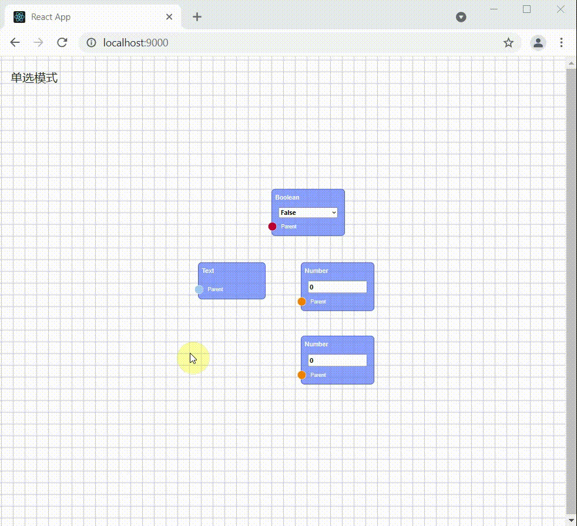
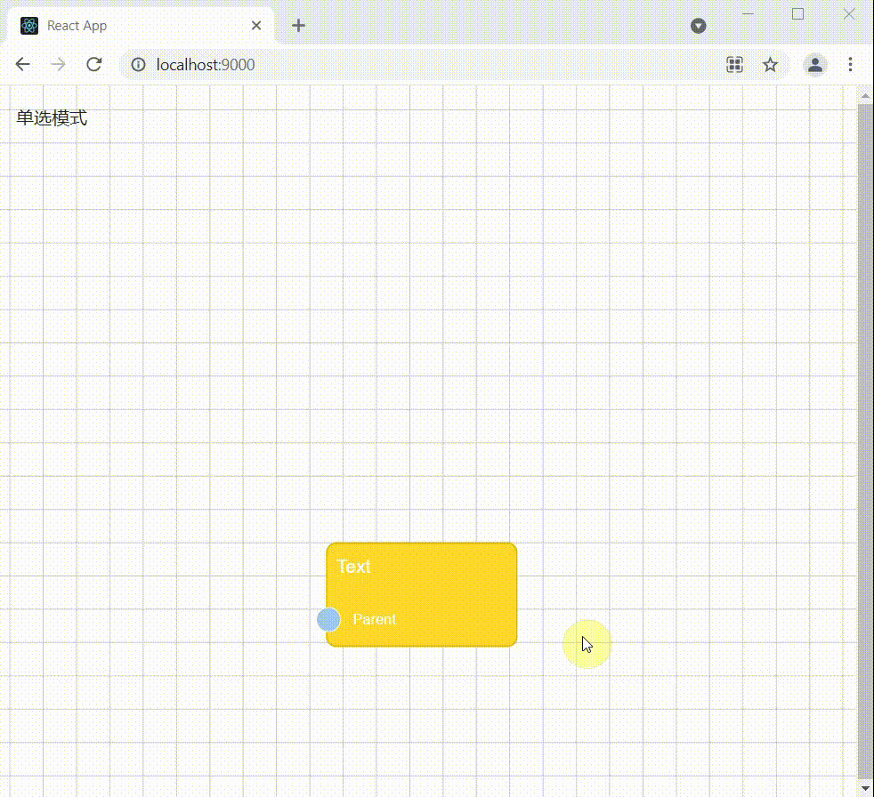

Rete area plugin
====
Adds functionality to the are of a rete js project

## Installation 

Plugin `install()` arguments:

```typescript
import AreaPlugin from 'rete-area-plugin';
function createEditor(container: HTMLElement) {
    var editor = new Rete.NodeEditor("demo@0.1.0", container);
    editor.use(AreaPlugin, {
        background: true, 
        snap: true,
        scaleExtent: {
            min: 0.5,
            max: 1,
        },
        translateExtent: { 
            width: 5000, 
            height: 4000 
        }
    });
}
```

If `background` is set to `true`, a grid is displayed on the background behind nodes:


if `snap` is set to true, dragged elements will snap to grid


`scaleExtent` sets the min/max scale of the background



`translateExtent` sets the translation limits for width and height



## ZoomAt

the `zoomAt()` function sets the editor to start set the nodes in its viewpoint

```typescript
import AreaPlugin from 'rete-area-plugin';
function createEditor(container: HTMLElement) {
    var editor = new Rete.NodeEditor("demo@0.1.0", container);
    AreaPlugin.zoomAt(editor, editor.nodes);
}
```

